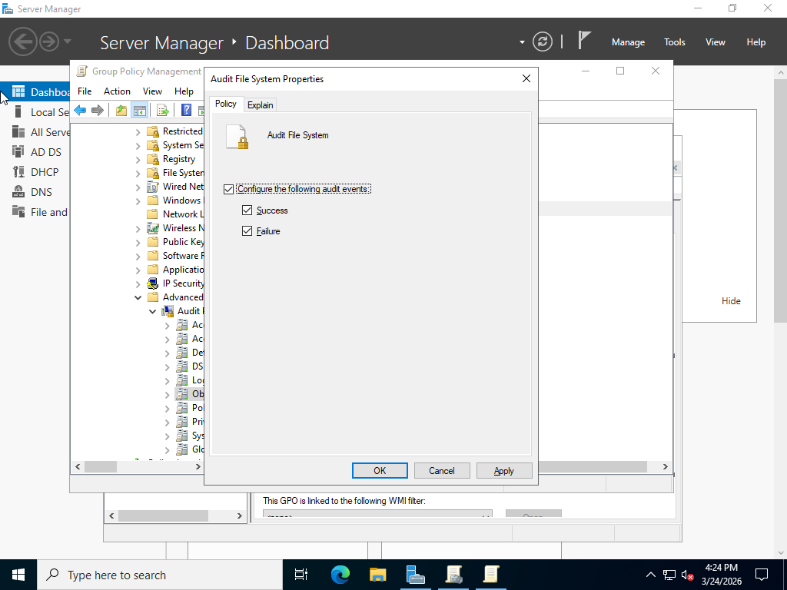
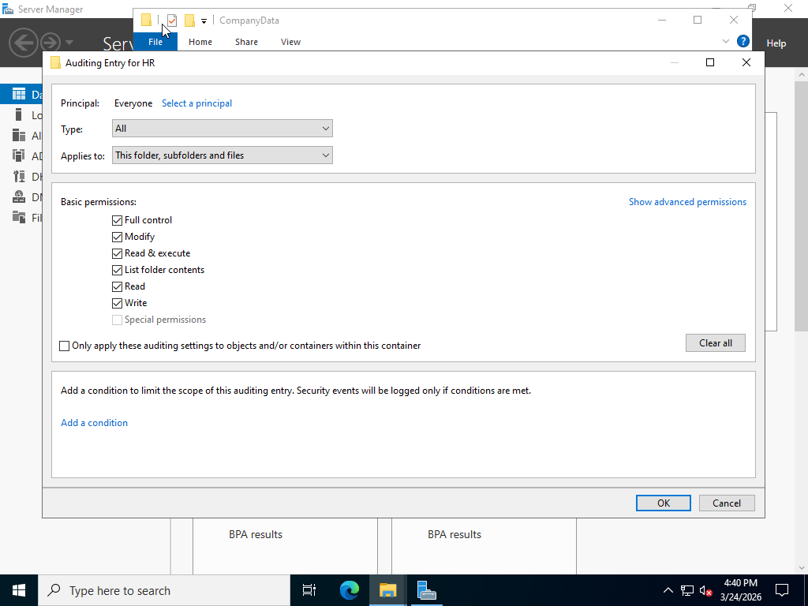
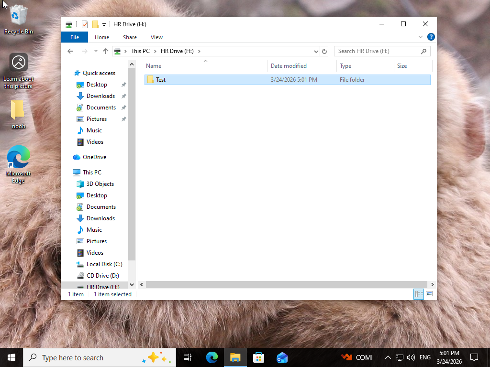
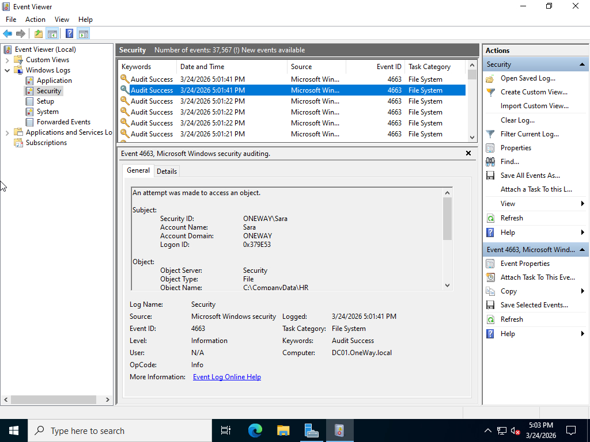
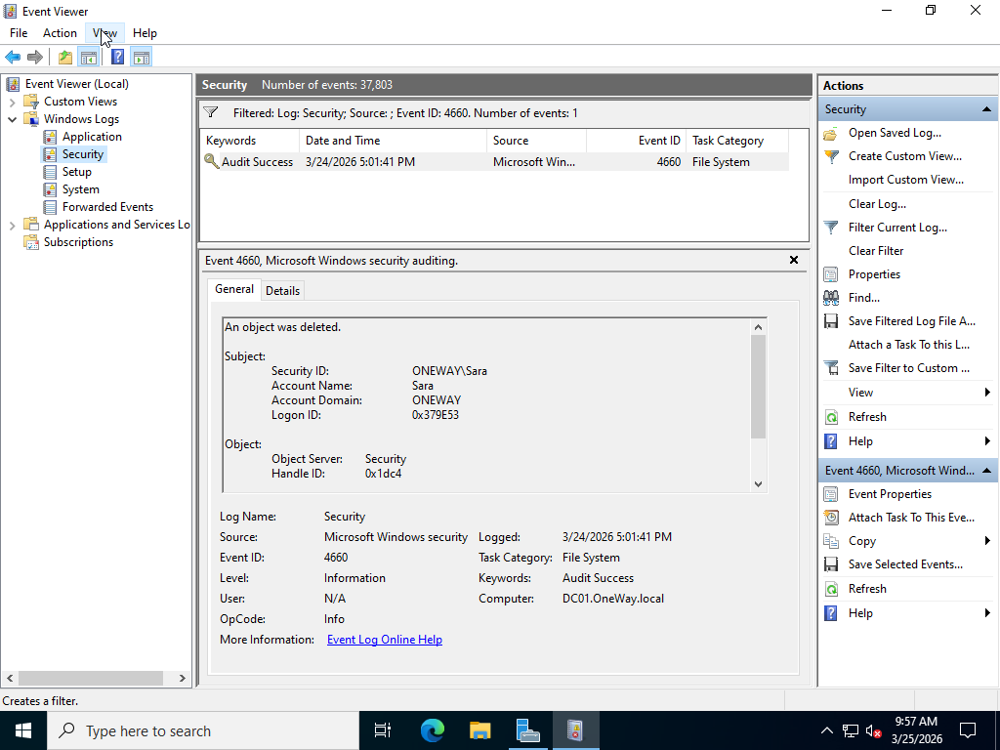

# Active Directory File Auditing Lab

## Overview

This lab demonstrates how to monitor file access and user activity using auditing in a Windows Server environment.

File auditing enables administrators to track user actions such as file access, modification, and deletion, which is essential for security monitoring and incident investigation.

---

## Lab Environment

Domain Controller: DC01  
Domain: OneWay.local  
Client Machine: Windows 10  

Technologies Used:

- Windows Server 2022
- Active Directory
- Group Policy
- Event Viewer

---

## Configuration Steps

### 1. Enable File System Auditing Policy

Open:

Group Policy Management  
Default Domain Policy → Edit  

Navigate to:

Computer Configuration  
Policies  
Windows Settings  
Security Settings  
Advanced Audit Policy Configuration  
Audit Policies  
Object Access  

Enable:

Audit File System → Success + Failure

---

### 2. Apply Group Policy

Run the following command:
  gpupdate /force

---

### 3. Configure Folder Auditing

Right click the target folder (example: D:\Shared\HR):

Properties → Security → Advanced → Auditing → Add  

Configure:

- Principal: Everyone  
- Type: Success + Failure  
- Permissions:
  - Read  
  - Write  
  - Delete  

---

### 4. Testing

From the client machine:

- Open the shared folder  
- Create a file  
- Modify a file  
- Delete a file  

---

### 5. Monitor Events

Open:

Event Viewer  
Windows Logs  
Security  

Important Event IDs:

| Event ID | Description |
|--------|-------------|
4663 | File access |
4660 | File deleted |

---

## Screenshots

### Audit Policy Enabled

### Folder Auditing Configuration

### File Creation Test

### Event Viewer - File Access

### File Deletion Event

---

## Result

File auditing was successfully configured.

Administrators can now monitor user activity on files, including access, modification, and deletion events, improving security visibility and accountability within the domain environment.
